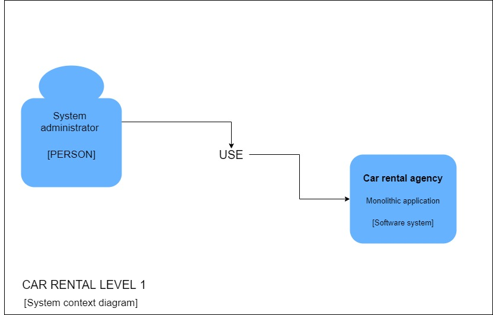
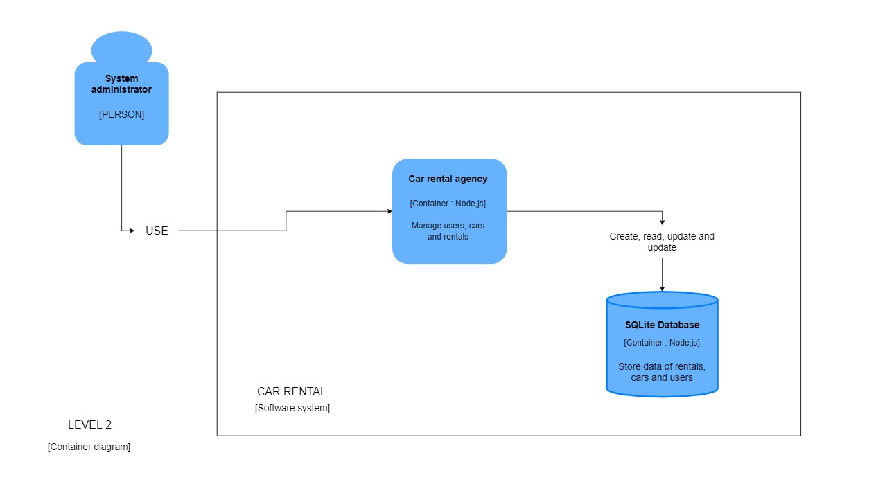
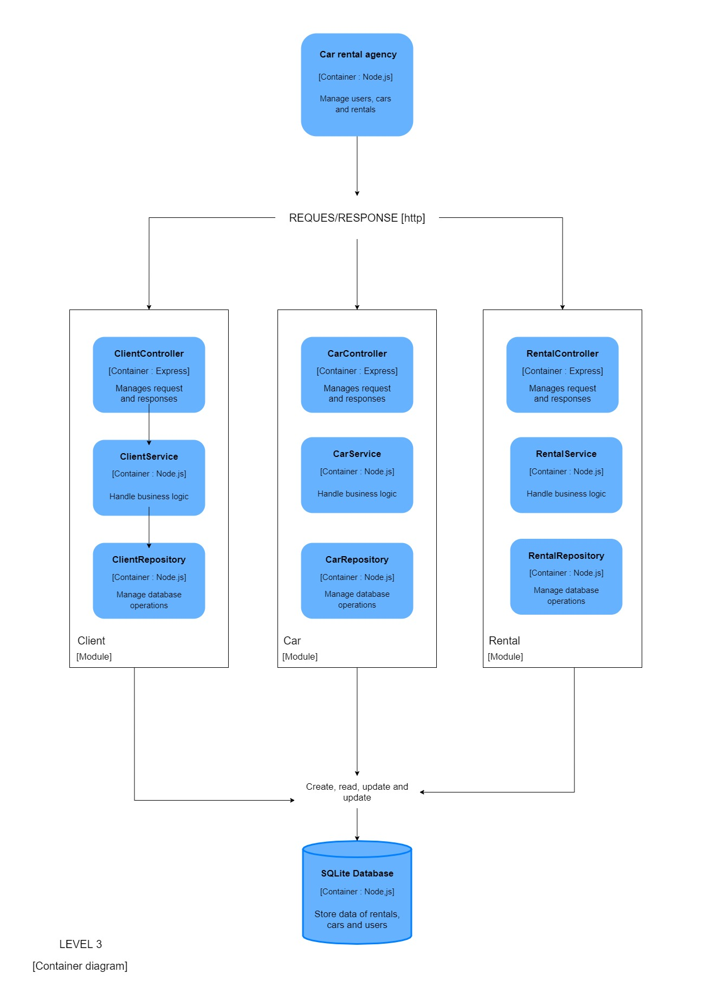

# CRUD/AMB de alquileres de autos.

Sistema de alquiler de autos usando Node.js.

# C4 DIAGRAM

## LEVEL 1

## LEVEL 2

## LEVEL 3

## Algunas dependencias y sus referencias:

* [Bulma.io](https://bulma.io/) como framework de CSS.
* [Sequelize](https://sequelize.org/master/) ORM de node.js basado en promesas para el uso de base de datos.
* [Express.js](https://expressjs.com/) para la creación de un servidor web.
* [RSDI](https://www.npmjs.com/package/rsdi) para el uso del Dependency Injection Container en node.js.
* [Nunjucks](https://mozilla.github.io/nunjucks/) para el renderizado de templates.

